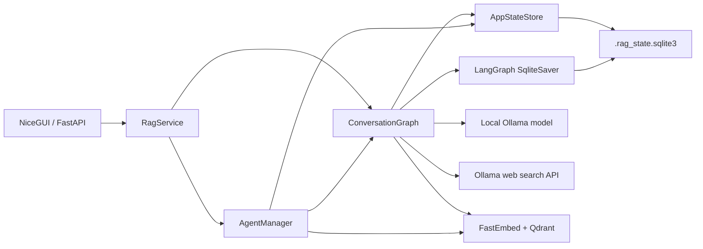
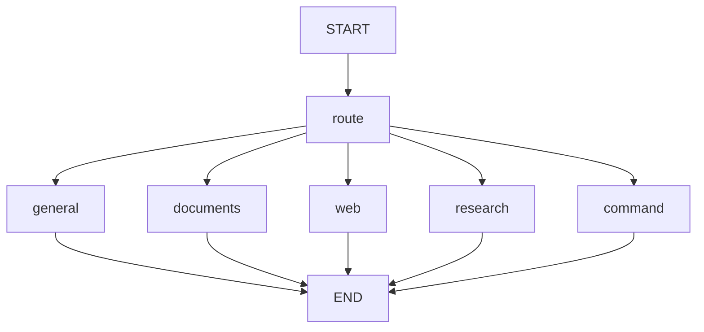
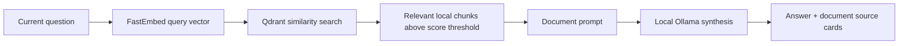
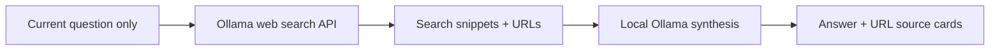
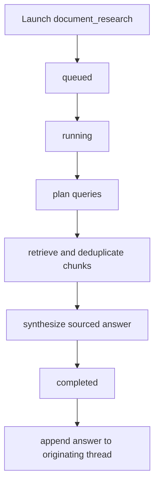
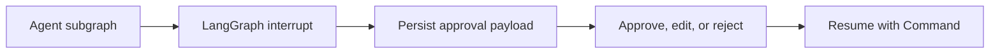

# LangGraph Assistant Architecture

This document explains how LangGraph turns the project from a document-only RAG
service into a local-first personal assistant. The main application remains a
FastAPI and NiceGUI service. LangGraph coordinates chat routing, persistent
conversation state, and background document-research agents.

## Runtime Overview

The service is assembled in `src/rag_app/service.py`. A single `RagService`
instance connects:

- `ConversationGraph` for interactive chat.
- `AgentManager` for queued background agents.
- `AppStateStore` for application-owned SQLite records.
- LangGraph `SqliteSaver` for durable conversation checkpoints.
- Qdrant and FastEmbed for private-document retrieval.
- Local Ollama inference through `ChatOllama`.
- Ollama cloud web search when `OLLAMA_API_KEY` is configured.
- MLflow tracing and prompt registry integration.

## Interactive Chat Graph

`ConversationGraph` is defined in `src/rag_app/assistant.py`. Every `/chat`
request invokes the same compiled graph with a LangGraph `thread_id`. The
checkpoint saver reloads prior messages for that thread and writes the updated
state after the request.

The graph state includes:

| Field | Purpose |
| --- | --- |
| `messages` | Persistent LangChain message history, merged with `add_messages`. |
| `question` | Current user question. |
| `requested_mode` | User-selected mode: `auto`, `general`, `documents`, `web`, or `research`. |
| `resolved_mode` | Route selected for the current request. |
| `thread_id` | Durable conversation identifier. |
| `top_k` | Maximum retrieved document chunks per query. |
| `answer` | Final response text. |
| `sources` | Document chunks or web URLs returned to the UI. |
| `warnings` | Non-fatal routing and configuration messages. |
| `agent_run_id` | Background research run identifier when research is launched. |

## Routing

The `route` node respects an explicit mode selection first. In `auto` mode, the
local model returns a structured `RouteDecision` with one of four routes:

| Mode | Behavior |
| --- | --- |
| `general` | Answers from the local model, current thread history, and explicit saved facts. It does not query Qdrant. |
| `documents` | Embeds the current question, retrieves Qdrant chunks, and asks the local model to answer from those chunks. |
| `web` | Sends only the current question to Ollama web search, then asks the local model to synthesize the returned snippets with URL citations. |
| `research` | Enqueues a background `document_research` agent and immediately returns its run ID. |

If automatic routing fails, the graph falls back to `general` and returns a
warning. If automatic routing selects `web` without an `OLLAMA_API_KEY`, it also
falls back to `general`. If the configured web-search provider is temporarily
unavailable, automatic routing also falls back to local General mode with a
warning. Forced Web mode instead returns a controlled error message.

The internal `command` route handles `/remember <fact>` and `/forget <id>`.

## Persistent Threads And Memory

The application uses `.rag_state.sqlite3` for two related forms of persistence:

1. LangGraph `SqliteSaver` stores checkpointed graph state, including thread
   messages.
2. `AppStateStore` stores app metadata in its own tables.

The app-owned tables are:

| Table | Purpose |
| --- | --- |
| `app_threads` | Thread IDs, titles, and timestamps. |
| `app_memory_facts` | Explicit facts saved by the user. |
| `app_agent_runs` | Background agent lifecycle, results, and sources. |
| `app_approvals` | Human approval payloads and decisions. |

SQLite uses WAL mode for concurrent reads and writes. Conversation history and
saved memory are separate concepts:

- Thread messages are loaded only for the active conversation.
- Saved facts are explicitly created through the UI or `/remember <fact>`.
- General and Documents prompts receive a bounded list of saved facts.
- Saved facts are not extracted automatically from chat.

Deleting a thread removes its metadata, associated agent runs, approvals, and
LangGraph checkpoints.

## Private-Document Retrieval

The Documents route reuses the existing RAG pipeline:

Document text stays within the local application and the configured Qdrant
deployment. Document chunks are not sent to Ollama web search.

Incremental ingestion removes Qdrant chunks for manifest sources that no longer
exist under `RAG_DOCS_ROOT`. `RETRIEVAL_SCORE_THRESHOLD` controls the minimum
cosine-similarity score accepted as document evidence.

## Web Search Privacy Boundary

The Web route keeps external search separate from local context:

The search provider sends the exact current question as the search query.
Thread history, explicit saved facts, and local document text are not included
in the outbound search request. Mixed document-and-web synthesis is intentionally
not implemented.

## Background Research Agent

`AgentManager` is defined in `src/rag_app/agents.py`. It ships with one registered
agent: `document_research`. Research runs use an in-process queue backed by a
`ThreadPoolExecutor`. The default concurrency is `1` to avoid overloading local
inference.

The research subgraph is read-only:

The planner asks the local model for distinct document-search queries. Retrieval
executes each query through the same FastEmbed and Qdrant path as Documents mode,
deduplicates chunks by Qdrant point ID, and checks for cancellation between
queries. The synthesis node creates a sourced answer and appends it to the
originating conversation.

Agent run states are:

| State | Meaning |
| --- | --- |
| `queued` | Waiting for worker capacity. |
| `running` | Currently executing. |
| `awaiting_approval` | Paused until a user decision is recorded. |
| `completed` | Result stored and appended to the thread. |
| `failed` | Execution raised an error. |
| `cancelled` | Cancellation was requested or an action was rejected. |
| `interrupted` | The application restarted before completion. |

Queued and running jobs are marked `interrupted` during application startup.
Restart-resumable workers are intentionally deferred. During graceful shutdown,
queued and running work is cancelled and worker threads are drained before
SQLite connections close. Thread deletion similarly cancels and drains
associated work before removing checkpoints and app metadata.

## Approval Support

The shipped `document_research` agent is read-only and does not request
approval. The runtime already supports future mutating agents that use LangGraph
interrupts:

`LangGraphAgentRunner` adapts an interrupt-capable compiled graph to the agent
runtime. Pending requests are stored in `app_approvals`, shown in the UI, and
resumed with a LangGraph `Command` after a decision.

## Tracing

The project keeps manual MLflow spans and enables `mlflow.langchain.autolog()`.
Traces include:

- Persistent thread ID as the MLflow session ID.
- Requested and resolved chat modes.
- Retrieval timings, embedding model, collection, and selected sources.
- LangGraph nodes and local model calls.
- Agent run ID, originating thread, lifecycle state, and result preview.
- Prompt role, registry source, alias, and version.

Prompt registry entries are split by role: router, general answer, document
answer, web answer, research planner, and research synthesis.

## Extension Points

To add another agent:

1. Define a LangGraph state and compiled graph in `src/rag_app/agents.py` or a
   dedicated agent module.
2. Wrap interrupt-capable graphs with `LangGraphAgentRunner`.
3. Register an `AgentDefinition` with a name, `read_only` flag, and runner.
4. Expose any agent-specific launch inputs through the API and UI.
5. Add lifecycle, cancellation, and approval tests.

For mutating automations, use a LangGraph interrupt before any external side
effect and require an explicit approval decision before resuming.
